# SIFNIC - Recorrido integral y manual de usuario base

Fecha de recorrido: 2026-04-30  
Ambiente probado: `http://localhost:5277`  
Usuario visual de prueba: `QA Manual`  

Este documento deja continuidad del recorrido funcional hecho sobre el sistema y sirve como base para el manual de usuario. Las capturas estan en `docs/manual_usuario/capturas/`.

## Resultado de prueba integral

- Compilacion backend: correcta, 0 errores y 0 advertencias.
- Pruebas API/funcionales: 17 exitosas de 17 en recorrido base, mas 5 validaciones de cartera real.
- Cliente usado para validacion: `Cliente Integral 0107`.
- Prestamo usado para validacion: `CRD-2026-000006`.
- Evidencia tecnica: `docs/manual_usuario/prueba-integral-resultados.json`.

Validaciones confirmadas:

- Carga de catalogos, listado y ficha de clientes.
- Detalle de prestamo activo desde cliente.
- Estado de cuenta imprimible.
- Plan de pago imprimible.
- Carga de catalogos, listado y expediente de solicitudes.
- Expediente y plan de pago imprimibles desde solicitud.
- Simulador de credito con cuota, endeudamiento y plan.
- Validacion negativa de plan invalido.
- Validacion negativa de cliente incompleto.
- Validacion negativa de solicitud incompleta.
- Cartera real: acceso por rol, jefe/admin ve toda la cartera y oficial solo ve prestamos asignados.
- Cartera real: detalle de prestamo, plan, pagos reales, recibos y tasas variables desde base de datos.

## 1. Ingreso al sistema

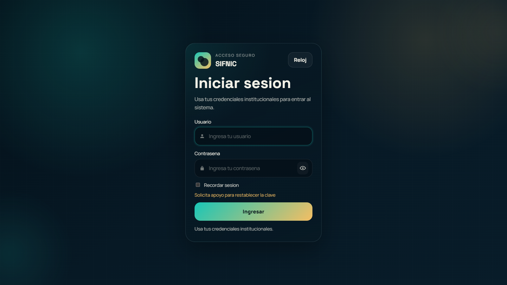

Uso:

- El usuario entra con sus credenciales institucionales.
- El sistema valida usuario y contrasena.
- Si la clave es temporal, debe pasar por cambio de clave antes de entrar.
- Desde esta pantalla tambien se puede abrir el reloj.

## 2. Panel principal

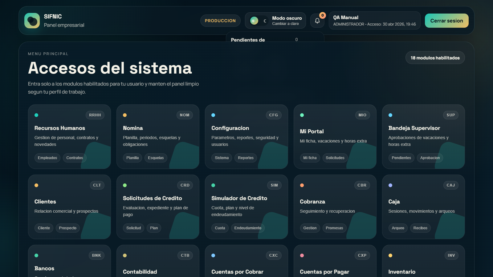

Uso:

- Muestra los modulos disponibles segun el rol.
- Cada tarjeta abre un modulo operativo.
- El panel esta pensado como punto unico de entrada para clientes, credito, RRHH, nomina, configuracion y portal.

## 3. Clientes

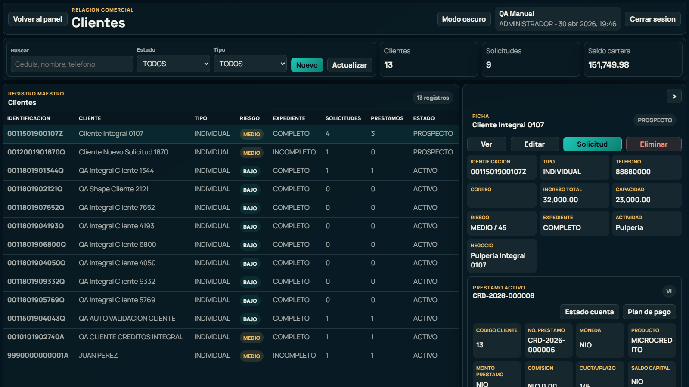

Uso:

- Buscar clientes por cedula, nombre o telefono.
- Filtrar por estado y tipo.
- Ver metricas rapidas de clientes, solicitudes y saldo de cartera.
- Seleccionar un cliente en la tabla para ver su ficha.

## 4. Cliente con prestamo activo

Uso:

- Al seleccionar un cliente con prestamo vigente, el panel derecho muestra la ficha y el prestamo activo.
- Incluye resumen: numero de prestamo, producto, moneda, monto, comision, cuota/plazo, saldo, tasa y proxima cuota.
- Tiene botones separados para imprimir `Estado cuenta` y `Plan de pago`.

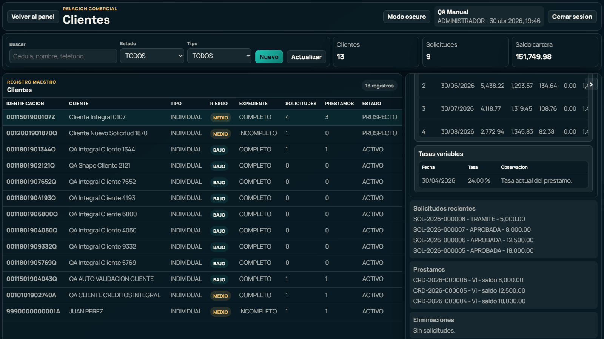

Uso:

- Estado de cuenta: pagos, dias de atraso, interes, mora, abono a capital y saldo.
- Calendario de pagos: cuota, fecha, saldo, capital, interes, otros, valor cuota y estado.
- Tasas variables: historial de tasas aplicadas al prestamo.

Nota: el estado de cuenta actual se deriva del plan de pago hasta que Caja/Cobros registre movimientos reales.

## 5. Nuevo cliente

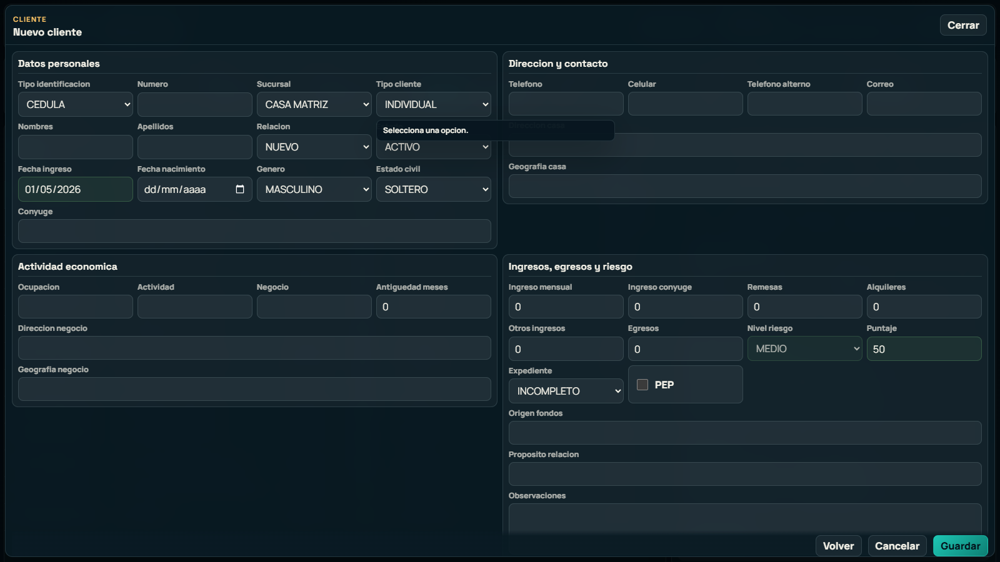

Uso:

- Capturar datos personales, actividad economica, contacto, ingresos, egresos y riesgo.
- La fecha de ingreso queda automatica del dia.
- La cedula ayuda a inferir datos cuando aplica.
- El sistema valida campos obligatorios antes de guardar.

## 6. Solicitudes de credito

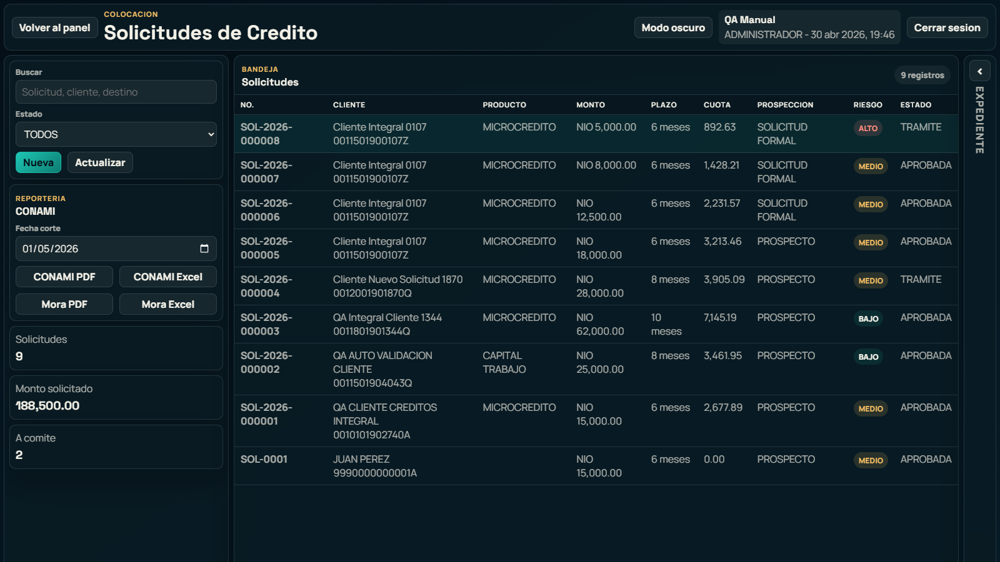

Uso:

- Consultar solicitudes por cliente, producto, monto, plazo, cuota, riesgo y estado.
- Filtrar por estado.
- Acceder a reporteria CONAMI, mora y exportaciones.

## 7. Expediente de solicitud

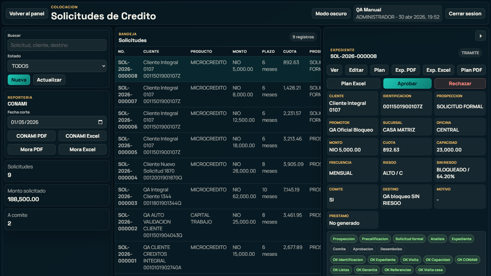

Uso:

- Ver la solicitud seleccionada.
- Revisar checklist de expediente.
- Generar expediente en PDF/Excel.
- Generar plan de pago en PDF/Excel.
- Aprobar o rechazar segun permisos y validaciones.

## 8. Nueva solicitud

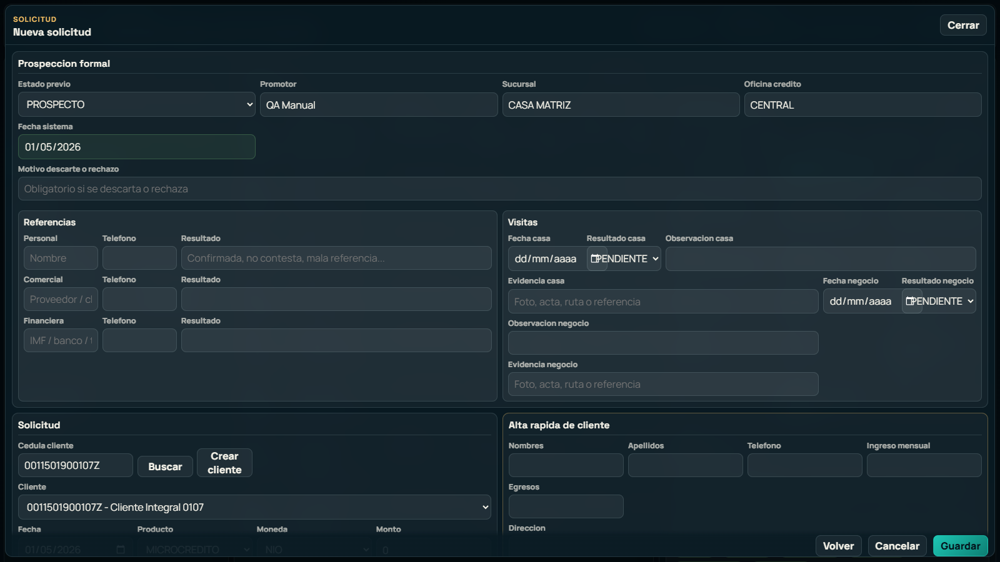

Uso:

- Seleccionar cliente existente o cargar datos desde la cedula.
- Capturar monto, plazo, tasa, frecuencia, destino y capacidad.
- Registrar referencias y visitas.
- Calcular cuota y plan.
- Validar endeudamiento antes de continuar.

## 9. Simulador de credito

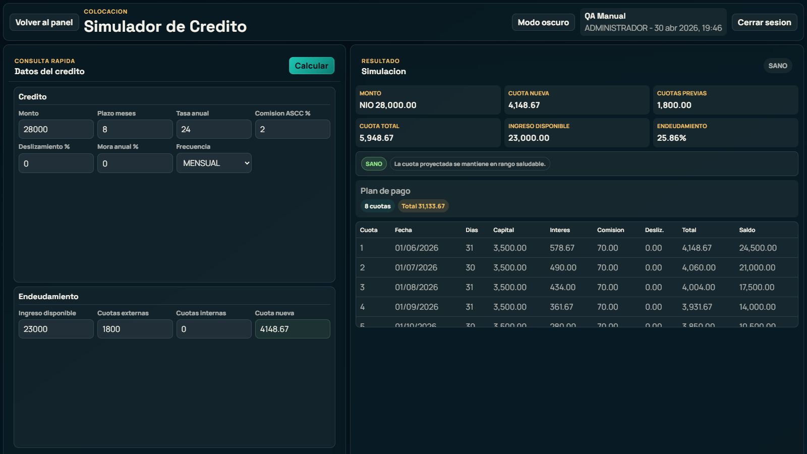

Uso:

- Permite consultar cuota sin crear solicitud formal.
- El usuario ingresa monto, plazo, tasa, comision, deslizamiento y frecuencia.
- Se digitan cuotas externas/internas para calcular nivel de endeudamiento.
- El sistema calcula automaticamente la nueva cuota y muestra el plan proyectado.

## 10. Cartera y cobranza

Uso:

- El acceso del dashboard `Cartera y Cobranza` abre `/App/Cartera`.
- Jefe de credito, gerente de credito, administracion y administrador pueden ver toda la cartera.
- Oficial de credito solo consulta los prestamos que tiene activos en `creditos.asignacion_oficial_credito`.
- La cartera se arma con datos reales de `creditos.credito`, `creditos.plan_pago_credito`, `creditos.pago_credito`, `creditos.recibo_pago_credito`, `creditos.tasa_variable_credito` y la asignacion de oficial.
- El panel muestra saldo capital, saldo vencido, dias de mora, proxima cuota, ultimo pago, riesgo, clasificacion CONAMI y oficial responsable.
- Desde el detalle se abren las impresiones existentes de estado de cuenta y plan de pago.
- Desde el detalle se puede aplicar un pago. Al aplicar, el sistema registra pago, aplica rubros, actualiza plan/saldo, crea movimiento de caja, genera voucher y abre la impresion del recibo en formato ticket TMU.
- Los pagos recientes de cartera imprimen el mismo voucher TMU; Caja queda como segunda entrada para buscar y reimprimir.

Validacion tecnica agregada:

- Sin token de sesion, `/Cartera/Catalogos` responde `401`.
- Con sesion administrativa temporal de prueba, `/Cartera/Listar` devolvio 18 de 18 creditos activos.
- Con sesion temporal de oficial de credito `id_usuario=6`, `/Cartera/Listar` devolvio 12 de 12 creditos asignados.
- El mismo oficial recibio `404` al intentar abrir un prestamo activo sin asignacion (`id_credito=18`), evitando ver cartera ajena o no asignada.

## 11. Caja

Uso:

- El boton `Caja` del dashboard abre `/App/Caja`.
- La pantalla de Caja fue reorganizada como caja operativa rapida: estado de caja arriba y botones separados para `Abonar credito`, `Vouchers` y `Arqueo`.
- En `Abonar credito` el flujo queda en tres pasos visibles: buscar prestamo, registrar cobro y revisar desglose del pago.
- La sucursal de apertura se toma desde `seguridad.usuario.id_sucursal` y `empresa.sucursal`. Para usuarios con rol de caja/cajero queda como sucursal fija asignada; perfiles administrativos pueden cambiarla cuando corresponda.
- Caja permite abrir sesion por cajero/sucursal con monto inicial NIO/USD y desglose por denominacion.
- Para aplicar pagos desde Caja se busca el prestamo por credito, cedula o cliente; al seleccionar se llenan cliente, moneda y cuota pendiente para evitar digitacion.
- Al seleccionar un credito se cargan automaticamente saldo capital, proxima cuota y distribucion estimada por capital, interes, comision, mora y deslizamiento.
- El desglose del pago se calcula en vivo con el monto recibido: abono capital, abono intereses, abono mora y comision/otros.
- El pago exige sesion de caja abierta, moneda, forma de pago, abonante y monto.
- La moneda recibida en caja puede ser distinta de la moneda del credito. El sistema toma el tipo de cambio USD/NIO institucional vigente desde `parametros.tipo_cambio_institucional`, muestra el monto que se aplicara al credito y guarda ambos valores: efectivo recibido en NIO/USD y monto aplicado en la moneda del prestamo.
- Caja no usa el tipo de cambio oficial BCN para aplicar pagos. El oficial queda reservado para procesos contables y reportes; Caja usa institucional compra cuando recibe USD para credito NIO, e institucional venta cuando recibe NIO para credito USD.
- Si el credito es en cordobas y el cliente paga en dolares, Caja registra USD fisicos y aplica el equivalente en NIO al plan. Si el credito es en dolares y el cliente paga en cordobas, Caja registra NIO fisicos y aplica el equivalente en USD al plan.
- Cada pago actualiza la sesion de caja, los saldos teoricos, el plan de pago y el saldo del credito.
- El arqueo muestra saldo teorico NIO/USD, ingresos por moneda/forma de pago y ultimos movimientos.
- El cierre de caja captura saldo fisico NIO/USD y desglose por denominacion, calcula diferencias y guarda el cierre.
- El boton `Hoja arqueo` imprime la hoja formal de arqueo con apertura, ingresos, saldos teoricos, fisico, diferencias, desglose por denominacion, movimientos y firmas.
- Caja permite buscar vouchers por numero de voucher, recibo oficial, credito, cedula o cliente.
- Cada pago aplicado genera voucher en `creditos.recibo_pago_credito` y recibo oficial en `caja.recibo_oficial_caja`.
- El formato de impresion de pago es ticket angosto para impresora TM-U/TMU: ancho aproximado 80 mm, fuente monoespaciada, separadores punteados, totales alineados y firmas al final.
- El voucher imprime el desglose del pago con nombres operativos: `Abono capital`, `Abono intereses`, `Abono mora` y `Comision / otros`.
- La reimpresion tiene dos opciones:
  - `Reimprimir`: imprime con marca visible `REIMPRESION`.
  - `Copia limpia`: imprime el mismo voucher sin leyenda de reimpresion.

Validacion tecnica agregada:

- `/App/Caja` responde correctamente.
- `/Caja/ListarRecibos` sin sesion responde `401`.
- Con sesion administrativa temporal de prueba, `/Caja/ListarRecibos` devolvio 2 vouchers existentes.
- `/Caja/BuscarCreditos` devuelve prestamos activos para aplicar pagos.
- `/Caja/AplicarPago` sin caja abierta devuelve `400` y bloquea el pago.
- La aplicacion de pago calcula conversion cruzada NIO/USD con `parametros.tipo_cambio_institucional`; no se aplico un pago real de prueba para no alterar saldos de cartera productivos.
- Apertura y cierre de caja fueron validados con sesion temporal, desglose NIO/USD y limpieza posterior de datos QA.
- `/Caja/HojaArqueoHtml` genera la hoja de arqueo imprimible con secciones de resumen de saldos y movimientos.
- `/Caja/VoucherPagoHtml?id=2&reprint=true` muestra marca `REIMPRESION`.
- `/Caja/VoucherPagoHtml?id=2&reprint=false` no muestra la marca.
- La validacion negativa de pago rechaza monto cero y prestamo invalido con `400`.

## 12. Configuracion

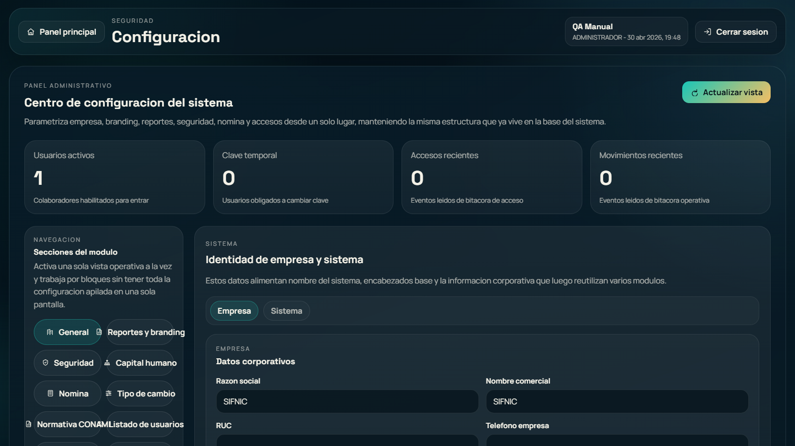

Uso:

- Administrar identidad del sistema, parametros generales, seguridad, nomina, tipo de cambio, reglas CONAMI, usuarios y bitacoras.
- Las reglas CONAMI deben mantenerse como parametros y catalogos, no como valores quemados en codigo.
- Solo roles administrativos deben acceder a esta pantalla.

## 13. Recursos Humanos

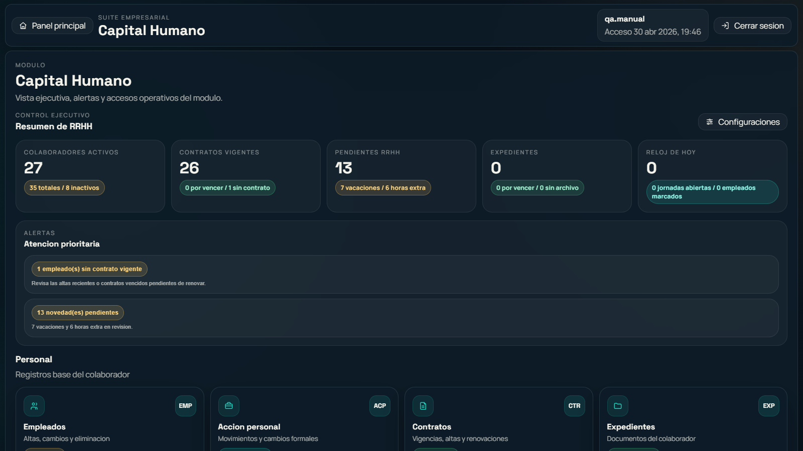

Uso:

- Gestionar empleados, contratos, novedades, acciones de personal, expedientes y estructura.
- El organigrama formal debe mantenerse separado del flujo operativo de aprobaciones.

## 14. Nomina

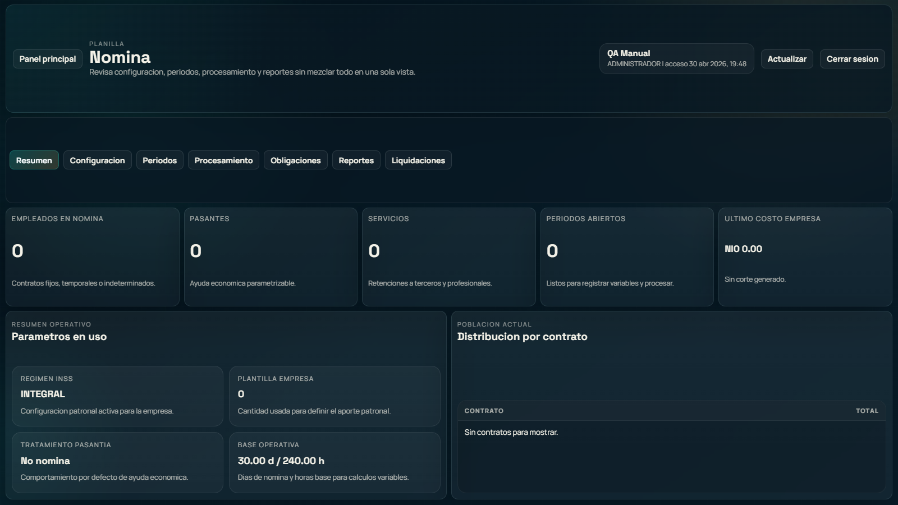

Uso:

- Configurar parametros de nomina.
- Administrar periodos.
- Procesar planillas.
- Consultar obligaciones, reportes y liquidaciones.

## 15. Mi Portal

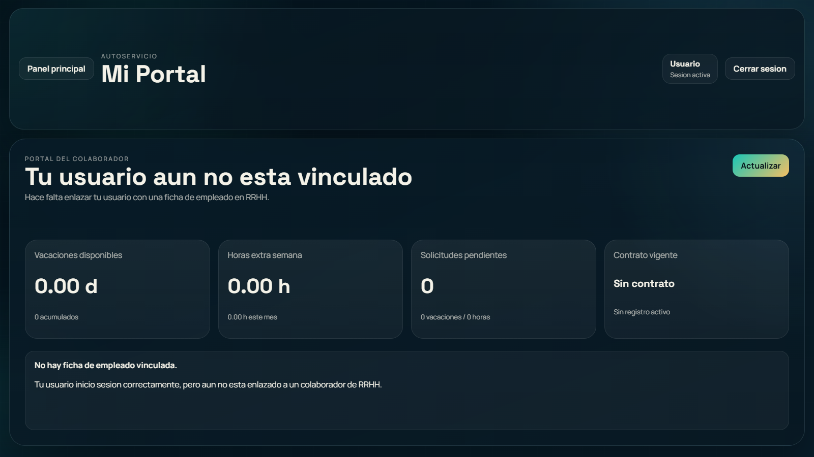

Uso:

- El colaborador consulta su ficha.
- Puede revisar vacaciones, horas extra y solicitudes propias.
- Debe mostrar a quien reporta y su ubicacion dentro de la estructura formal.

## 16. Bandeja Supervisor

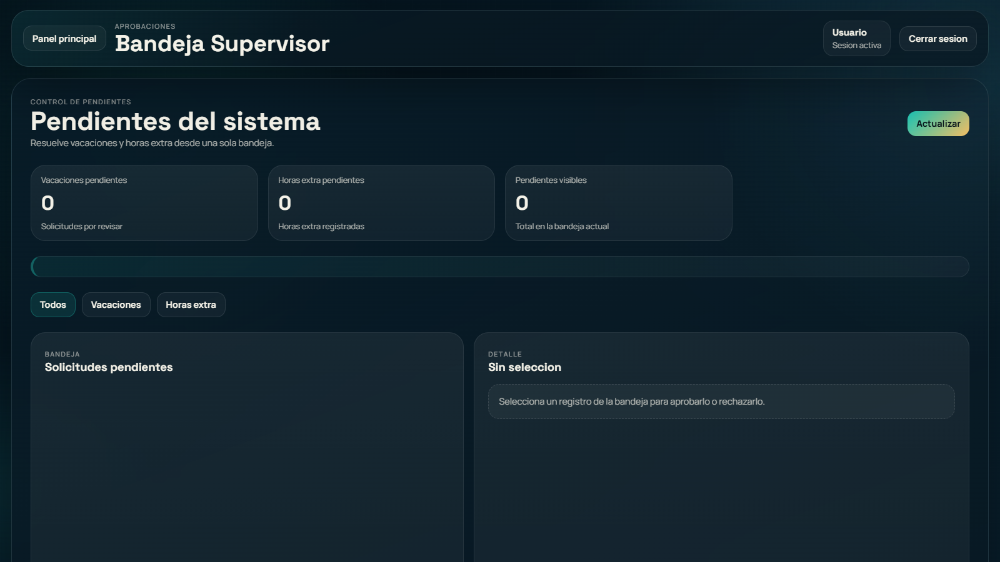

Uso:

- El supervisor revisa pendientes de vacaciones y horas extra.
- Puede filtrar por tipo.
- Al seleccionar un registro, revisa el detalle y aprueba o rechaza segun permisos.

## Pendientes para cerrar el sistema

1. Completar Cobranza operativa: promesas de pago, visitas, compromisos, gestores, rutas y resultado de gestion.
2. Completar Caja/Cobros transaccional para reversos, anulaciones autorizadas y recalculo automatico de mora desde recibos. La aplicacion de pagos y voucher TMU ya quedo conectada a Caja/Cartera con moneda recibida, tipo de cambio y moneda del credito.
3. Completar Bancos, Contabilidad, Cuentas por Cobrar, Cuentas por Pagar, Inventario, Captaciones, Cumplimiento y Regulatorio; hoy aparecen en el dashboard, pero no todos tienen modulo operativo completo.
4. Integrar o parametrizar la consulta externa de historial crediticio. El historial no lo genera SIFNIC; debe venir de SIN RIESGO u otra fuente externa, y el oficial digita deudas vigentes cuando corresponda.
5. Completar el expediente digital de credito con documentos adjuntos, evidencias de visita, fotos, georreferencia y control de vencimientos.
6. Convertir mas normas CONAMI en reglas editables: limites por producto, endeudamiento, garantias, mora, provision, reestructuracion, castigo, partes relacionadas y reportes regulatorios.
7. Completar exportaciones PDF/Excel con formato institucional final para todos los reportes regulatorios.
8. Agregar flujo de desembolso, autorizaciones, contabilizacion automatica y provision regulatoria.
9. Reforzar auditoria: bitacora por cambio de datos sensibles, eliminaciones autorizadas, aprobaciones y cambios de tasa.
10. Probar con usuarios reales y permisos reales; algunas capturas administrativas se hicieron con sesion QA visual para documentar pantallas, pero deben validarse con credenciales operativas reales.
11. Agregar pruebas automatizadas end-to-end para cliente, solicitud, aprobacion, desembolso, cobro, mora y cierre.
